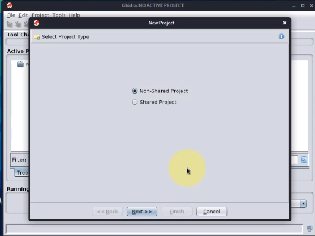
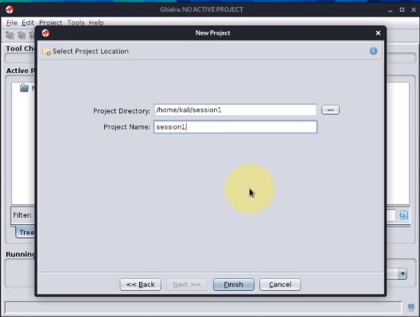
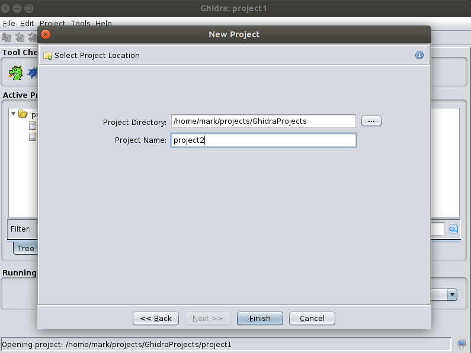
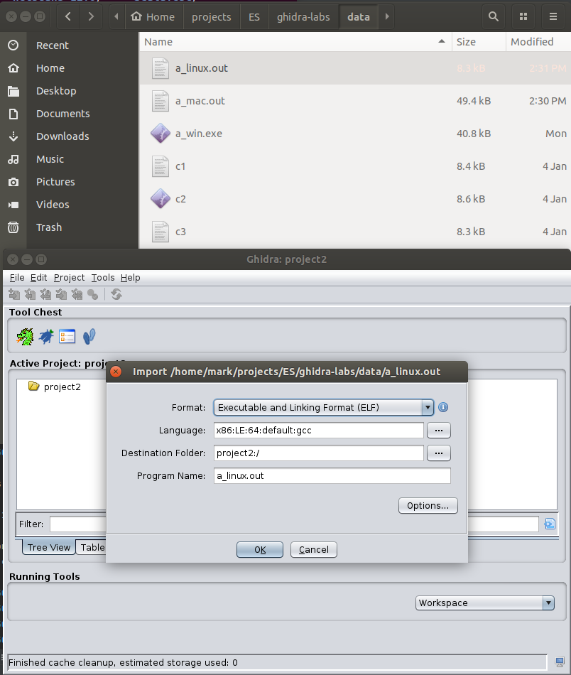
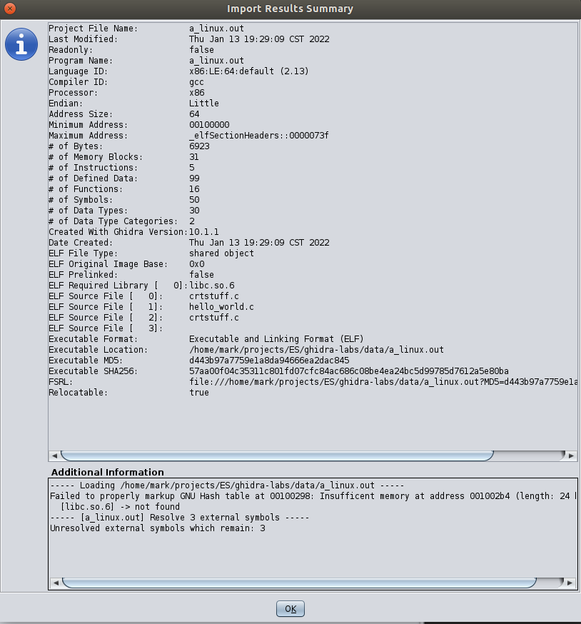
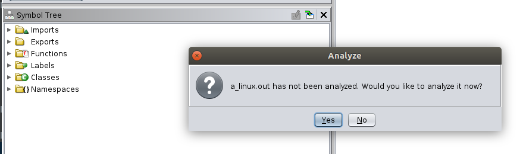
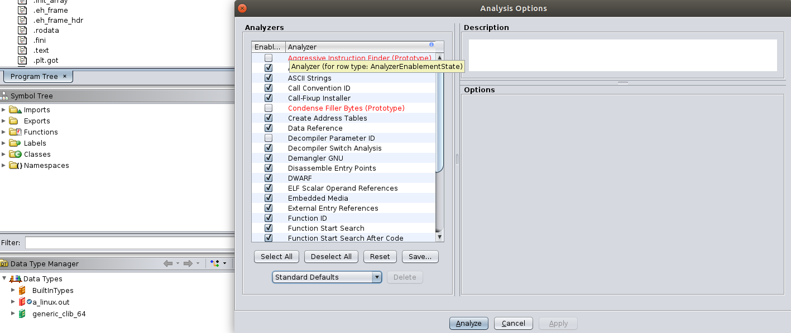
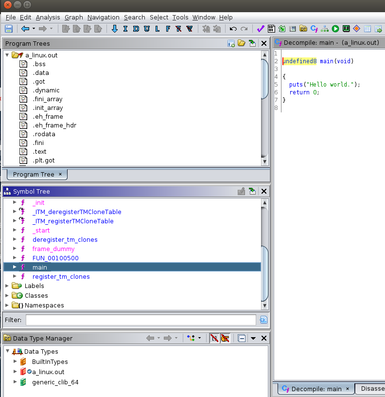
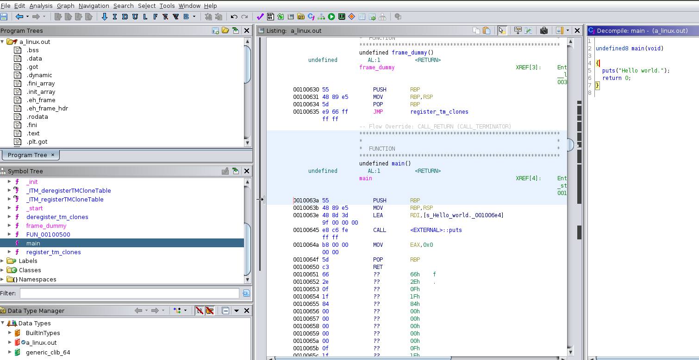
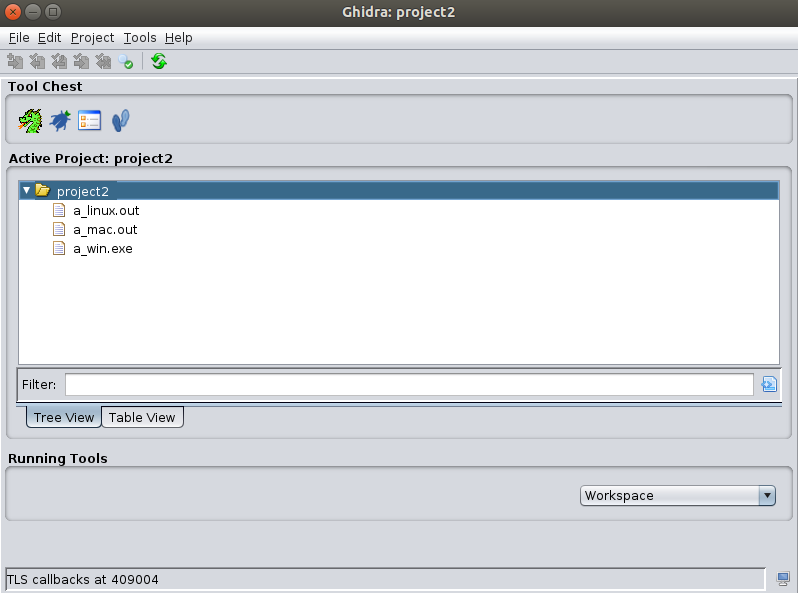

# Lab 02: Compile and decompile

## Overview
* Let us look at the data
* We will be using this 

## Depends On
* [Lab 01](../lab01), Ghidra install

## Run time
30 mins

## Step 1: Compile a sample program

* Install `gcc` in your environment
* Compile the `hello_world.c` code
* Get an executable for Linux, Mac, Windows
* Run it
* Doing your compile will be useful if you want to change it
* If you have trouble compiling the code, you can use executables provided in the lab

## Create a project

* You can only work in a project
* Create a non-shared project

* Place the project in a directory

* Give the project a name

* Add a file to your project

* Examine the output

* Analyze the code
  * Double-click on the file, or
  * Drag it into the Ghidra icon, or
  * Click on the Ghidra
  * Choose the standard option

* Ghidra is analyzing the code using the scripts in this window

## Analyze code

* Go to functions
* Find main
* Look at decompiled code

## Decompile window

* Click on the listing (assembly) and observe the decompiled view (C)

## Analyze the executable for all three platforms: Linux, Mac, Windows

## Congratulations on completing the lab!

