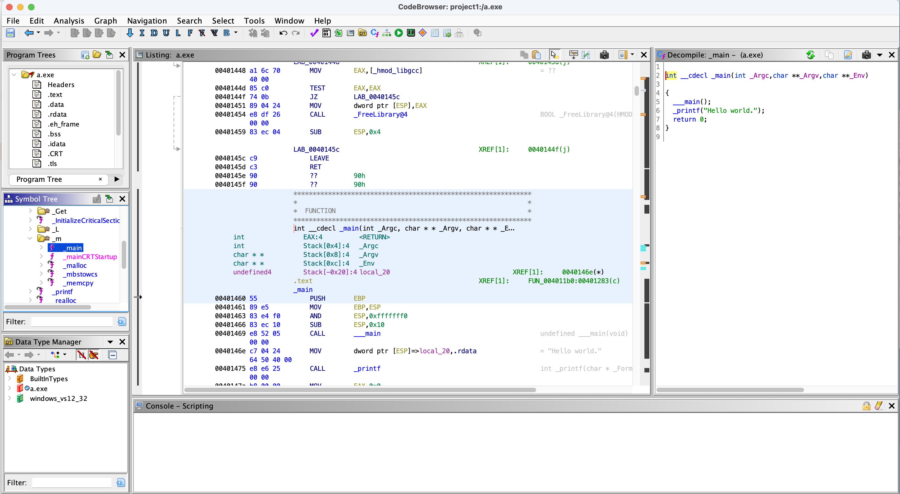

# Lab 02: Data investigation

## Overview
* Let us look at the data
* We will be using this 

## Depends On
None

## Run time
20 mins

## Step 1: Run the `c1`

* In the Linux or Mac, run the program
* Instructor will demo the lab to see what needs to be done

### Step 2: `hello_world.c`

