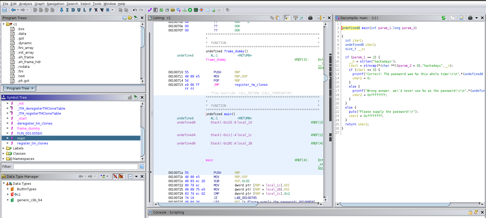
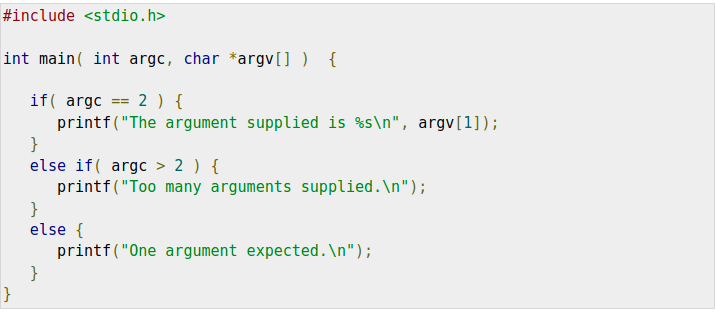
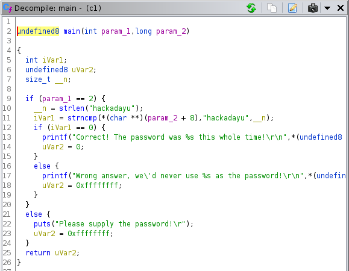
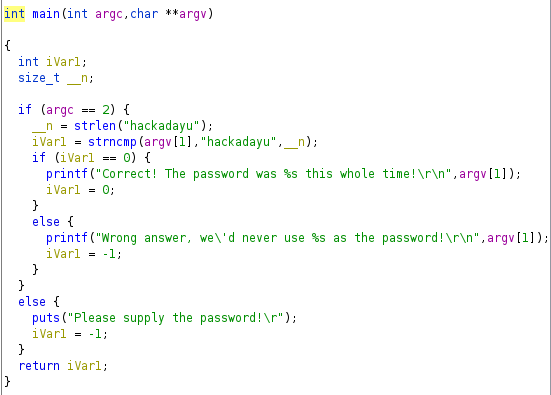

# Lab 03: Decompile files

## Overview
* Let us look at the executables
* Decompile and analyze them

## Depends On
* [Lab 01](../lab01), Ghidra install


## Run time
30 mins

## Step 1: Investigate c1

* You will need a Linux environment to run the code
* But you will only need Ghidra to investigate it

```shell
./c1
Please supply the password!
```

* Another attempt

```shell
 ./c1 dhdie
Wrong answer, we'd never use dhdie as the password!
```

## So, to find out more, you start Ghidra



* The trainer will demo how to get to this point

## Analyze code

* You can see the structure of a C program [here](https://www.tutorialspoint.com/cprogramming/c_command_line_arguments.htm)



* Let us take the decompiler output, and rename some variables to bring them more in line

* We have this decompiler output



* But we want this

