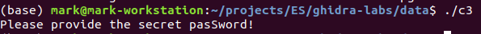
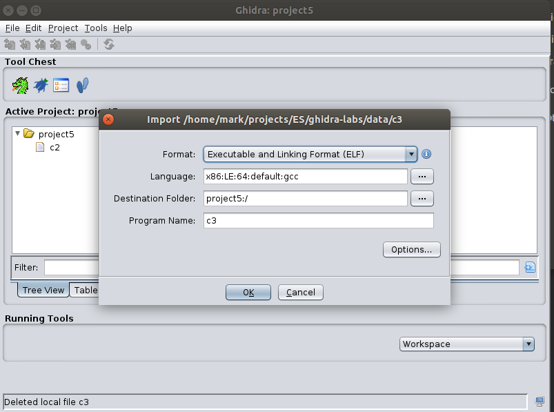
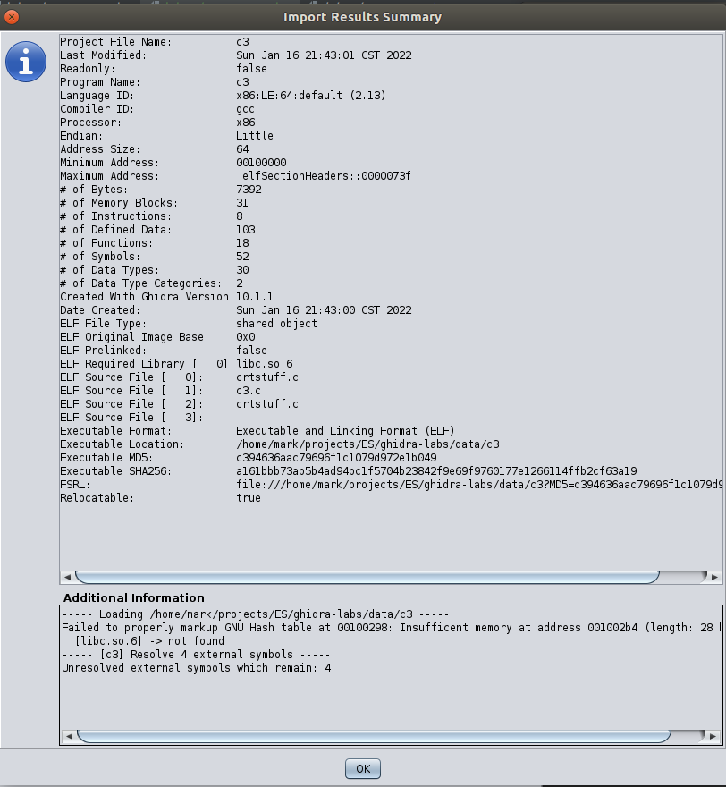
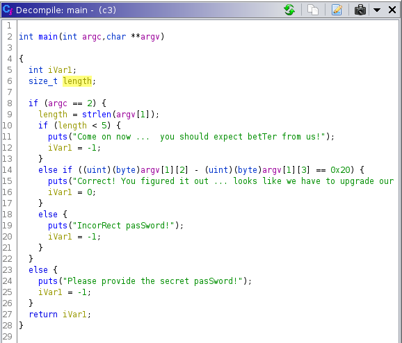
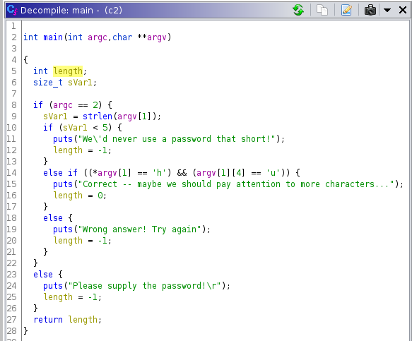
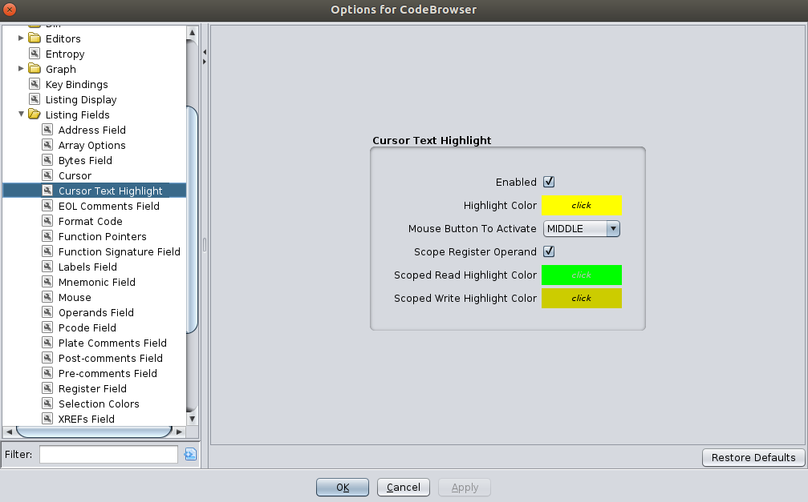
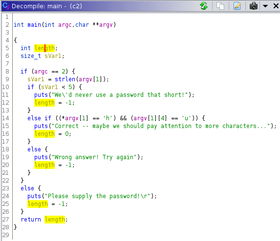

# Lab 05: Analyze variables

## Overview
* Look at executable c3
* Analyze and solve

## Depends On
* [Lab 01](../lab01), Ghidra install

## Run time
30 mins

## Step 1: Investigate c3

* You will need a Linux environment to run the code
* But you will only need Ghidra to investigate it

* Somewhat different behaviour

* So, let's load it into Ghidra

### Step 2: Load into Ghidra

* Analyze the executable

* Do the usual changes

* Start renaming variables (Right click of CTRL-L)

* Edit->Tool Options->Listing fields->Cursor text highlight

* And there - all `length`s are highlighted

### Step 3: Do the hex calculations

### Step 4: Figure out the password

