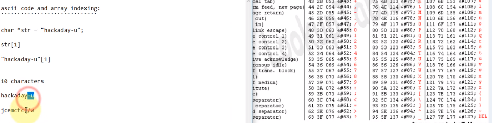

# Lab 06: Code analysis

## Overview
* Stepping into functions
* Adding comments

## Depends On
* [Lab 01](../lab01), Ghidra install


## Run time
30 mins

## Step 1: Investigate c4

* You will need a Linux environment to run the code
* But you will only need Ghidra to investigate it
* Start by running the program


## Step 2: Let's guess

```text
./c4 aaa
Come on now ...  you should expect better from us!
```

* More guesses

```text
./c4 123456789987987654
Wrong Password!
```

## Step 2: We need to analyze the code!
* Load into Ghidra


## Step 3: Figure out the password



## Step 4: Celebrate

* (Partial image)


